# FzLib.Avalonia

注：以下二级标题与源码中的目录对应，与命名空间不对应。为简化命名空间，一般来说，所有命名空间最长为三级，即`FzLib.Avalonia.*`。

## `Behaviors`命名空间

### `SmoothScrollBehavior`类

用于为ScrollViewer和包含ScrollViewer的TextBox、ListView等控件的滚动区域提供在鼠标滚轮滚动时平滑移动的行为。

```xaml
<ScrollViewer b:SmoothScrollBehavior.IsEnabled="True">
```

```xaml
<TextBox b:SmoothScrollBehavior.IsEnabled="True">
```

### `VisualDragBehavior`类

为Visual（基本包含各类可见的控件）控件提供拖动功能，并限制在其父容器范围内。

```xaml
  <Border>
            <Grid RowDefinitions="*,8,Auto,8,*">
                <TextBlock
                    Grid.Row="2"
                    HorizontalAlignment="Center"
                    VerticalAlignment="Center"
                    IsHitTestVisible="False"
                    Text="点击黄块拖动控件" />
                <Border
                    Grid.Row="4"
                    Width="24"
                    Height="24"
                    HorizontalAlignment="Right"
                    VerticalAlignment="Bottom"
                    Background="Yellow">
                    <Interaction.Behaviors>
                        <b:VisualDragBehavior Target="{Binding #bd}" />
                    </Interaction.Behaviors>
                </Border>
            </Grid>
```

```csharp
var behavior = new VisualDragBehavior
{
    Target = bdDialog
};
Interaction.GetBehaviors(thumb).Add(behavior);
```

### `WindowDragBehavior`类

为窗口提供拖动功能

```xaml
 <Border>
     <Interaction.Behaviors>
         <b:WindowDragBehavior />
     </Interaction.Behaviors>
</Border>
```

## `Controls`命名空间

### `CancelableTaskButton`类

提供一个可以取消的按钮。点击按钮后，执行`Command`，同时按钮显示取消字样，保持可点击；再次点击，执行`CancelCommand`，并向`Command`通知Cancel，按钮置灰，直至完成`CancelCommand`。

```xaml
<c:CancelableTaskButton
    CancelCommand="{Binding DoSthCancelCommand}"
    TaskCommand="{Binding DoSthCommand}" />
```

```csharp
[RelayCommand(IncludeCancelCommand = true)]
private async Task DoSthAsync(CancellationToken cancellationToken)
{
    try
    {
        await Task.Delay(10 * 1000, cancellationToken);
    }
    catch (OperationCanceledException)
    {
        await dialogService.ShowWarningDialogAsync("任务被取消", "任务被取消");
    }
}
```

### `FilePickerTextBox`类

提供一组由标签、文本框和按钮组成的文件选取条，点击按钮弹出文件选取对话框，可将文件拖入文本框。支持配置打开文件、保存文件或选择文件夹。

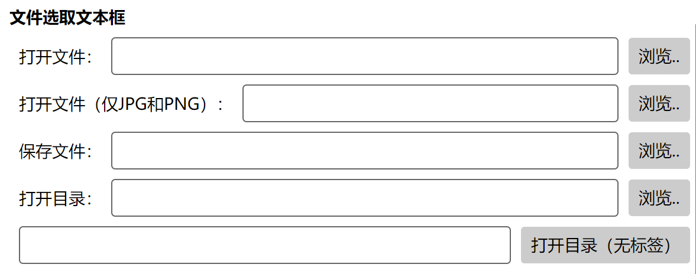

```xaml
<ct:FilePickerTextBox
    Label="打开文件："
    Type="OpenFile" />
<ct:FilePickerTextBox
    Label="打开文件（仅JPG和PNG）："
    StringFileTypeFilter="JPEG图片;*.jpg,*.jpeg;image/jpeg;|PNG图片;*.png;image/png;"
    Type="OpenFile" />
<ct:FilePickerTextBox
    Label="保存文件："
    SaveFileSuggestedFileName="建议的文件名"
    Type="SaveFile" />
<ct:FilePickerTextBox
    Label="打开目录："
    Type="OpenFolder" />
<ct:FilePickerTextBox
    ButtonContent="打开目录（无标签）"
    Type="OpenFolder" />
```

## `Controls.Forms`目录

### `FormItem`类

提供一个表单容器，支持在容器的左侧和上方添加标签，下方添加描述

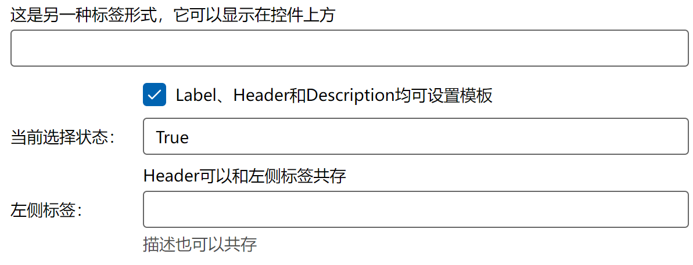

```xaml
<c:StackFormItemGroup>
    <c:FormItem Header="这是另一种标签形式，它可以显示在控件上方">
        <TextBox />
    </c:FormItem>
    <c:FormItem
        Header="{Binding .}"
        Label="当前选择状态：">
        <c:FormItem.HeaderTemplate>
            <DataTemplate x:DataType="vm:FormViewModel">
                <CheckBox
                    Content="Label、Header和Description均可设置模板"
                    IsChecked="{Binding FormHeaderIsChecked}" />
            </DataTemplate>
        </c:FormItem.HeaderTemplate>
        <TextBox
            IsReadOnly="True"
            Text="{Binding FormHeaderIsChecked}" />
    </c:FormItem>
    <c:FormItem
        Description="描述也可以共存"
        Header="Header可以和左侧标签共存"
        Label="左侧标签：">
        <TextBox />
    </c:FormItem>
</c:StackFormItemGroup>
```

### `StackFormItemGroup`类

一个为`FormItem`特化的纵向`StackPanel`，能够自动调整内部所有`FormItem`的`Label`的宽度到一致。

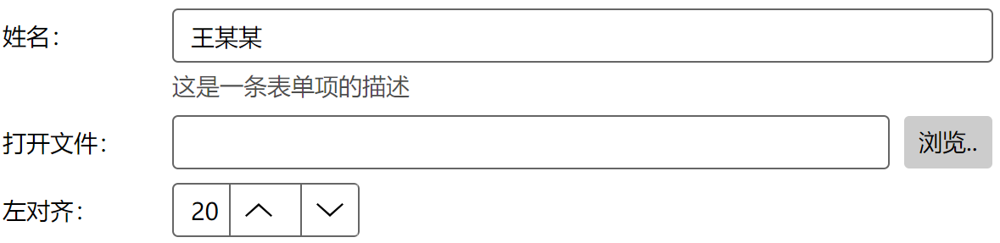

```xaml
<c:StackFormItemGroup>
    <c:FormItem
        Description="这是一条表单项的描述"
        Label="姓名：">
        <TextBox Text="王某某" />
    </c:FormItem>
    <c:FormItem Label="打开文件：">
        <c:FilePickerTextBox Type="OpenFile" />
    </c:FormItem>
    <c:FormItem Label="左对齐：">
        <NumericUpDown
            HorizontalAlignment="Left"
            Value="20" />
    </c:FormItem>
</c:StackFormItemGroup>
```

### `WrapFormItemGroup`类

一个为`FormItem`特化的横向`WrapPanel`，能够自动调整内部所有`FormItem`的`Label`的宽度到一致。


```xaml
<c:WrapFormItemGroup>
    <c:FormItem Label="文本框：">
        <TextBox
            Width="120"
            Text="" />
    </c:FormItem>
    <c:FormItem Label="选择框：">
        <ComboBox
            Width="120"
            SelectedIndex="0">
            <ComboBoxItem>选项1</ComboBoxItem>
            <ComboBoxItem>选项2</ComboBoxItem>
            <ComboBoxItem>选项3</ComboBoxItem>
            <ComboBoxItem>选项4</ComboBoxItem>
        </ComboBox>
    </c:FormItem>
    <c:FormItem Label="数字选择：">
        <NumericUpDown
            Width="120"
            FormatString="0" />
    </c:FormItem>
    <CheckBox
        VerticalAlignment="Center"
        Content="非表单元素" />
    <Button Content="非表单元素" />
    <Button
        Classes="Link"
        Content="非表单元素" />
</c:WrapFormItemGroup>
```

## `Controls.ItemsControls`目录

### `ILayoutChangeable`接口, `ItemsControlLayout`枚举

`ILayoutChangeable`为`ItemsControl`的`ItemsPanel`提供抽象属性的接口。

`ItemsControlLayout`提供了不同`ItemsPanel`的枚举，其中`VerticalStack`和`HorizontalStack`为`StackPanel`，`VerticalWrap`和`HorizontalWrap`为`WrapPanel`，`UniformGrid`为`UniformGrid`。

### `RadioButtonGroup`类

提供一组按钮样式的`RadioButton`，由`ListBox`实现，用户可以在选项之间切换，实现单选功能。可以使用`SelectedIndex`绑定选择的序号，或者使用`SelectedItem`绑定选择的项。

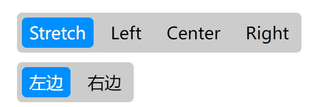

```xaml
<c:RadioButtonGroup
    ItemsSource="{me:EnumValues HorizontalAlignment}"
    Layout="{Binding #listLayout.SelectedItem}"
    SelectedIndex="{Binding SelectedIndex1}"
    SelectedItem="{Binding SelectedItem1}"
    Spacing="{Binding #sldSpacing.Value}" />
<c:RadioButtonGroup
    Columns="2"
    ItemsSource="{Binding Items2}"
    Layout="{Binding #listLayout.SelectedItem}"
    Rows="1"
    SelectedIndex="{Binding Selected2, Converter={x:Static cvt:Converters.BoolZeroOne}}"
    SelectedItem="{Binding SelectedItem2}"
    Spacing="{Binding #sldSpacing.Value}" />
```

### `StringListEditor`类

用于编辑一个`string`列表，使用`ItemsSource`绑定一个`FzLib.Text.ObservableStringList`。支持修改字符串，支持在列表中追加、插入或删除字符串

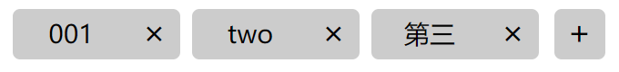

```xaml
<c:StringListEditor ItemsSource="{Binding StringList}"/>
```

## `Controls.Progresses`目录

### `ProgressRing`类

提供了一个Windows10样式的由旋转的点组成的进度环，用于表示某项任务正在进行中，但不知晓具体的进度百分比。


### 	`ProgressRingOverlay`类

提供一个全屏的半透明遮罩，并在中央显示进度环

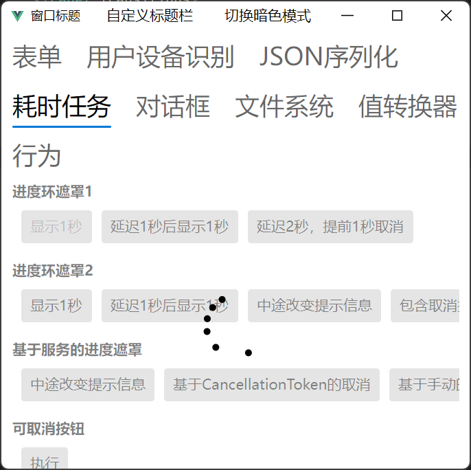

### `ProgressRingBoxOverlay`类

提供一个全屏的半透明遮罩，在中间显示一个包含标题、进度环、信息和取消按钮的框

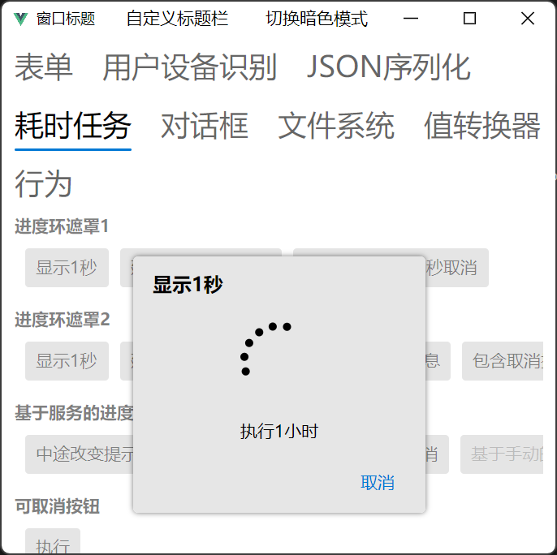

### `IProgressOverlayService`接口, `ProgressOverlayService`实现类

提供一个服务类，在使用`Attach`绑定`ProgressRingOverlay`或`ProgressRingBoxOverlay`控件后，或使用`Register`注册行为后，即可在任意代码中调用绑定的对话框遮罩。

在启动时：

```csharp
builder.Services.AddProgressOverlayService();
```

在界面中：

```xaml
<c:ProgressRingBoxOverlay
    x:Name="loading
    CancelCommand="{Binding CancelCommand}" />
```

后台代码中：

```csharp
App.Services.GetRequiredService<IProgressOverlayService>().Attach(loading);
```

ViewModel中调用：

```csharp
public partial class TaskViewModel(IProgressOverlayService progressOverlay) ：ObservableObject
{
    private Task ShowLoading1Async()
    {
        return ProgressOverlay.WithOverlayAsync(async () =>
          {
              ProgressOverlay.SetMessage("正在处理（1/3）");
              await Task.Delay(1000);
              ProgressOverlay.SetMessage("正在处理（2/3）");
              await Task.Delay(1000);
              ProgressOverlay.SetMessage("正在处理（3/3）");
              await Task.Delay(1000);
          });
    }
    
    private Task ShowLoading2Async()
    {
        bool stopped = false;
        return ProgressOverlay.WithOverlayAsync(async () =>
        {
            ProgressOverlay.SetMessage("执行1小时");
            while (!stopped)
            {
                await Task.Delay(1000);
            }
        },
        async () =>
        {
            ProgressOverlay.SetMessage("正在取消");
            await Task.Delay(1000);
            ProgressOverlay.SetVisible(false);
            stopped = true;
        });
    }
}
```

## `Controls.Windows`目录

### `ExtendedWindow`类

提供一个功能稍强的窗口。与`Window`的主要区别在于：

- 在Windows10中，暗色模式下，标题栏能够同步变色
- 无边框模式下，能够显示阴影
- 在Windows系统中，标题栏中按钮左侧可放置自定义控件
- 其他系统中，与普通窗口一致
- 增加`IsClosed`、`TitleBarBackground`等属性，`BringToFront`等方法

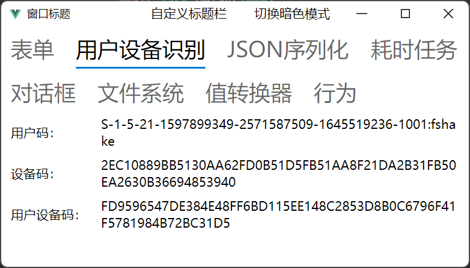

### `WindowButtons`类

提供与Windows10风格类似的窗口关闭、最小化和最大化按钮组，避免了Windows10在暗色模式、自定义标题栏下按钮鼠标悬浮颜色错误的BUG

### `WindowExtension`类

为窗口提供了若干扩展方法

## `Converters`命名空间

提供了一系列用在XAML中的值转换器。

### `Bases`目录

通用的转换器抽象类

`BoolToValueConverterBase`：`Bool`转泛型值

`ValueToBoolConverter`：泛型值转`Bool`

### `Basics`目录

| 转换器名称               | 功能描述                                 | 主要属性/参数                                                | 示例                                                         |
| ------------------------ | ---------------------------------------- | ------------------------------------------------------------ | ------------------------------------------------------------ |
| `BoolLogicConverter`     | 执行多布尔值的逻辑运算（AND/OR/XOR等）   | `Operator`：逻辑运算符类型 (And/Or/Xor/Nor/Nand/Xnor)；`NullOrUnsetBehavior`：处理null/UnsetValue的策略 | `Operator=or`, `true, false => true`                         |
| `BoolToIntegerConverter` | 布尔转数字                               | `TrueNumber`：true对应的数字；`FalseNumber`：false对应的数字 | `true => 1, false => 0`                                      |
| `BoolToStringConverter`  | 布尔转字符串                             | `TrueString`：true对应的字符串；FalseString：false对应的字符串 | `true => "是", false => "否"`                                |
| `CountToBoolConverter`   | 集合元素数量条件判断（大于/等于/小于等） | `ComparisonValue`：比较值 Operator：比较运算符               | `[] => false, [1,2] => true`                                 |
| `DescriptionConverter`   | 获取枚举值的`Description`特性描述        |                                                              | `enum E{[Description("啊") A]} => "啊"`                      |
| `EnumToBoolConverter`    | 将枚举类型转为布尔值                     | `TrueValues`：返回true的枚举值集合                           | `IsRunning => true, Ready => false, Stopped => false`        |
| `EqualToBoolConverter`   | 两个值的相等结果转布尔                   | `CompareType`：是否为比较类型，而非比较值；`ComparisionValue`：用于对比的值，若为空，则比较`parameter`；`StringComparison`：对于字符串，比较的参数 | `a = "abc", b = "ABC", StringComparison = OrdinalIgnoreCase, a, b=>true` |
| `InverseBoolConverter`   | 布尔值取反                               |                                                              | `true => false, false => true`                               |
| `NullToBoolConverter`    | 将null/空字符串转换为布尔值              | `ValueWhenNull`：null时返回的值； `AsNullIfStringWhiteSpace`：空字符串视为null | `null => false, "" => false, ok" => true`                    |
| `StringListConverter`    | 字符串列表与分隔字符串互相转换           | `DefaultSeparator`：默认分隔符 `AcceptedSeparator`：可接受的分隔符 | `["a", "b", "c"] => "a, b, ,c, ", "a，b,   c"=>["a", "b", "c"]` |
| `ValueMappingConverter`  | 值映射转换（字典映射）                   | `Map`：映射字典；`ThrowIfNotInMap`：未找到映射时是否抛出异常 | `1 => "One", 2 => "Two"`                                     |

### `FileSystems`目录

| 转换器名称                  | 功能描述                                 | 主要属性/参数     | 示例                                                         |
| --------------------------- | ---------------------------------------- | ----------------- | ------------------------------------------------------------ |
| `FileLengthConverter`       | 字节大小转易读格式                       | `Units`：单位数组 | `1234567 => "11.77 MB"`                                      |
| `FilePickerFilterConverter` | `FilePickerFileType`与字符串格式互相转换 |                   | `"Images;*.png,*.jpg;image/png,image/jpeg;public.image" => List<FilePickerFileType>` |
| `TransferSpeedConverter`    | 传输速度转易读格式                       | `Units`：单位数组 | `1234567 => "11.77 MB/s"`                                    |

### `Layouts`目录

| 转换器名称                      | 功能描述                                                     | 主要属性/参数                            | 示例                  |
| ------------------------------- | ------------------------------------------------------------ | ---------------------------------------- | --------------------- |
| `BoolToFontWeightConverter`     | 布尔值转字体粗细                                             | `TrueFontWeight`：true时的字体粗细       | `true => ` **text**   |
| `BoolToFontStyleConverter`      | 布尔值转字体样式（斜体等）                                   | `TrueFontStyle`：true时的字体样式        | `true => ` *text*     |
| `BoolToOpacityStyleConverter`   | 布尔值转透明的                                               |                                          |                       |
| `BoolToTextDecorationConverter` | 布尔值转文本装饰（下划线/上划线等）                          | `TrueTextDecoration`：true时的文本装饰   | `true =>` <u>text</u> |
| `BoolToTextWrappingConverter`   | 布尔值转文本换行行为                                         | `TrueTextWrapping`：true时的文本换行行为 |                       |
| NumberToAlignmentConverter      | 数字转布局的对齐方式（`1`=左/上，`2`=中，`3`=右/下，`0`=拉伸） |                                          |                       |
| NumberToThicknessConverter      | 数字转等宽`Thickness`                                        |                                          |                       |

### `Times`目录

| 转换器名称                | 功能描述                   | 主要属性/参数                              | 示例                                                         |
| ------------------------- | -------------------------- | ------------------------------------------ | ------------------------------------------------------------ |
| `TimeSpanConverter`       | `TimeSpan`与字符串互相转换 | `Format`：时间格式字符串                   | `new DateTime(12, 34, 56) => "12:34:56"`                     |
| `TimeSpanNumberConverter` | `TimeSpan`与数字互相转换   | 通过`parameter`指定转换类型(`"h"/"m"/"s"`) | `new DateTime(12, 34, 56) => "12:34:56", parameter="h" => "12.57"` |

### `Converters`类

提供一系列预设的值转换器静态字段。

使用时，在XAML中首先引用命名空间：

```xaml
xmlns:cvt="using:FzLib.Avalonia.Converters"
```

然后作为静态对象引用：

```xaml
IsVisible="{Binding Value, Converter={x:Static cvt:Converters.IsNotNull}}"
```

以下是包含的转换器：

| 字段名称                  | 转换器类型                      | 功能描述                                         |
| :------------------------ | :------------------------------ | :----------------------------------------------- |
| `Alignment`               | `NumberToAlignmentConverter`    | 数字转对齐方式（1=左/上，2=中，3=右/下，0=拉伸） |
| `AndLogic`                | `BoolLogicConverter`            | 多布尔值的逻辑与运算                             |
| `OrLogic`                 | `BoolLogicConverter`            | 多布尔值的逻辑或运算                             |
| `XorLogic`                | `BoolLogicConverter`            | 多布尔值的逻辑异或运算                           |
| `NorLogic`                | `BoolLogicConverter`            | 多布尔值的逻辑或非运算                           |
| `NandLogic`               | `BoolLogicConverter`            | 多布尔值的逻辑与非运算                           |
| `XnorLogic`               | `BoolLogicConverter`            | 多布尔值的逻辑同或运算                           |
| `BoldFontWeight`          | `BoolToFontWeightConverter`     | 布尔值转字体粗细（true=粗体）                    |
| `BoldOpacity`             | `BoolToOpacityStyleConverter`   | 布尔值转透明度（true=1, false=0）                |
| `BoolOneZero`             | `BoolToIntegerConverter`        | 布尔转数字（true=1, false=0）                    |
| `BoolZeroOne`             | `BoolToIntegerConverter`        | 布尔转数字（true=0, false=1）                    |
| `CountGreaterThanZero`    | `CountToBoolConverter`          | 判断集合元素数量是否大于0                        |
| `CountIsZero`             | `CountToBoolConverter`          | 判断集合元素数量是否等于0                        |
| `DateTime`                | `DateTimeConverter`             | 日期时间格式化转换                               |
| `Description`             | `DescriptionConverter`          | 获取枚举值的Description特性描述                  |
| `EqualWithParameter`      | `EqualToBoolConverter`          | 值与参数比较返回布尔结果                         |
| `FileLength`              | `FileLengthConverter`           | 字节大小转易读格式（自动使用KB/MB/GB等单位）     |
| `FilePickerFilter`        | `FilePickerFilterConverter`     | FilePickerFileType与字符串格式互相转换           |
| `InverseBool`             | `InverseBoolConverter`          | 布尔值取反（true ↔ false）                       |
| `IsNotNull`               | `NullToBoolConverter`           | 值不为null时返回true                             |
| `IsNull`                  | `NullToBoolConverter`           | 值为null时返回true                               |
| `ItalicFontStyle`         | `BoolToFontStyleConverter`      | 布尔值转字体样式（true=斜体）                    |
| `LightFontWeight`         | `BoolToFontWeightConverter`     | 布尔值转字体粗细（true=细体）                    |
| `NotEqualWithParameter`   | `EqualToBoolConverter`          | 值与参数不等时返回true                           |
| `OverlineTextDecoration`  | `BoolToTextDecorationConverter` | 布尔值转文本装饰（true=上划线）                  |
| `StringList`              | `StringListConverter`           | 字符串列表与分隔字符串互相转换                   |
| `TextWrapping`            | `BoolToTextWrappingConverter`   | 布尔值转文本换行方式（true=自动换行）            |
| `Thickness`               | `NumberToThicknessConverter`    | 数字转等宽Thickness                              |
| `TimeSpan`                | `TimeSpanConverter`             | TimeSpan与字符串互相转换                         |
| `TimeSpanNumber`          | `TimeSpanNumberConverter`       | TimeSpan与数字互相转换（可指定小时/分钟/秒）     |
| `TransferSpeed`           | `TransferSpeedConverter`        | 传输速度转易读格式（带单位）                     |
| `UnderlineTextDecoration` | `BoolToTextDecorationConverter` | 布尔值转文本装饰（true=下划线）                  |

## `DependencyInjection`命名空间

对`Microsoft.Extensions.DependencyInjection`的增强

### `DependencyInjectionExtension`类

为依赖注入提供扩展方法。目前仅支持一个方法，同时注入View和ViewModel、并在创建View时自动设置`DataContext`的功能

### `ViewModelInjection`类

实现 ViewModel 的自动依赖注入绑定机制。

Avalonia中，XAML中的控件必须为无参构造函数，这导致ViewModel无法作为控件参数注入。该类可以在XAML中给控件声明一个 `ViewModelType`，然后自动从依赖注入容器中解析并绑定到该控件的 `DataContext`，而无需手动在代码中设置 ViewModel。

例如，有一个View和一个ViewModel：

```csharp
public partial class SomeUserControl : UserControl
{
    public SomeUserControl()
    {
        InitializeComponent();
    }
}
public class SomeViewModel(IService1 service1, IService2 service2)
{
    ...
}
```

使用时，首先在依赖注入初始化中进行注册：

```csharp
var builder = Host.CreateApplicationBuilder();
...
var host = builder.Build();
ViewModelInjection.Register(host.Services);
host.Start();
```

然后在XAML中进行调用：

```xaml
xmlns:di="using:FzLib.Avalonia.DependencyInjection"
<v:SomeUserControl di:ViewModelInjection.ViewModelType="vm:SomeViewModel" />
```

## `Dialogs`命名空间

### `DialogHost`类

一个Avalonia 自定义对话框容器控件，是一个可复用的、跨平台的对话框基础类，用于统一管理弹窗显示逻辑、按钮行为、命令绑定与样式模板。

它是一切自定义对话框的基类。创建自定义对话框时，继承之。

```xaml
<dialog:DialogHost
    ...
    Title="选择对话框"
    CloseButtonContent="关闭"
    PrimaryButtonCommand="{Binding PrimaryButtonClickCommand}"
    PrimaryButtonContent="主要按钮"
    SecondaryButtonCommand="{Binding SecondaryButtonClickCommand}"
    SecondaryButtonContent="次要按钮"
    mc:Ignorable="d">
    <StackPanel>
        <TextBlock>自定义对话框，同时按钮命令符合MVVM</TextBlock>
        <ComboBox
            HorizontalAlignment="Stretch"
            SelectedIndex="{Binding SelectedIndex}">
            <ComboBoxItem>选项1</ComboBoxItem>
            <ComboBoxItem>选项2</ComboBoxItem>
            <ComboBoxItem>选项3</ComboBoxItem>
        </ComboBox>
        <TextBlock Text="{Binding Message}" />
    </StackPanel>
</dialog:DialogHost>
```

通过`Title`设置标题。

自带三个按钮。

| 按钮类型 | 虚拟方法（在View中实现）   | 命令（通常在ViewModel中实现） | 文本                     | 启用状态                   |
| -------- | -------------------------- | ----------------------------- | ------------------------ | -------------------------- |
| 主按钮   | `OnPrimaryButtonClick()`   | `PrimaryButtonCommand`        | `PrimaryButtonContent`   | `IsPrimaryButtonEnabled`   |
| 次按钮   | `OnSecondaryButtonClick()` | `SecondaryButtonCommand`      | `SecondaryButtonContent` | `IsSecondaryButtonEnabled` |
| 关闭按钮 | `OnCloseButtonClick()`     | `CloseButtonCommand`          | `CloseButtonContent`     | `IsCloseButtonEnabled`     |

通过`ShowDialog`和`ShowDialog<T>`显示对话框，其中`T`为返回值类型。`ShowDialog`方法实际为异步方法，为兼容习惯，未添加Async后缀。

```csharp
public async Task<T> ShowDialog<T>(DialogContainerType type, Visual visual)
```

支持多种显示容器。

| 枚举值 (`DialogContainerType`) | 描述                                                    |
| ------------------------------ | ------------------------------------------------------- |
| `ModelessWindow`               | 非模态窗口（不阻塞主窗口）                              |
| `Window`                       | 模态窗口（类似WinForms中的MessageBox）                  |
| `Popup`                        | 弹出式对话框，覆盖在页面上                              |
| `PopupPreferred`               | 优先使用Popup，否则使用Window                           |
| `WindowPreferred`              | 优先使用Window，否则（如在移动设备或浏览器中）使用Popup |

调用`Close()`方法直接关闭，调用`Close(T)`方法时可以返回一个值。

## `Dialogs.Containers`目录

### `IDialogHostContainer`接口，`IDialogHostContainer<TContainer>`接口

为对话框容器约定了`ShowDialog`和`Close`方法

### `PopupDialogContainer`类

通过在同一个`TopLevel`窗口的布局面板（暂时仅支持`Grid`）中添加对话框容器（嵌入视觉树），来实现模态对话框的弹出效果。支持弹出和消失动画，支持拖拽。

### `WindowDialogContainer`类

通过创建新窗口（Window）而非嵌入现有视觉树来实现模态对话框。无动画支持，仅支持桌面系统，资源开销较大，但支持真正的模态和非模态对话框。

## `Dialogs.Presets`目录

提供了一系列预设的对话框。这些对话框需要通过`FzLib.Avalonia.Dialogs.DialogService`进行调用。

### 文本对话框

`MessageDialog`类提供文本对话框的宿主UI。通过`MessageDialogContent`配置内容。

通过`ButtonDefinition`属性定义按钮组合。

| 枚举值        | 主要按钮 | 次要按钮 | 关闭按钮 |
| ------------- | -------- | -------- | -------- |
| `OK`          |          |          | `"确定"` |
| `YesNo`       | `"是"`   | `"否"`   |          |
| `YesNoCancel` | `"是"`   | `"否"`   | `"取消"` |
| `RetryCancel` | `"重试"` |          | `"取消"` |

可以设置以下属性：

| 属性        | 描述                                                    |
| ----------- | ------------------------------------------------------- |
| `Message`   | 显示在标题下方的具体信息                                |
| `Detail`    | 默认折叠，可按需展开的详细信息                          |
| `Icon`      | 显示在信息左侧的图标，使用满足SVG路径的数据字符串来表示 |
| `IconBrush` | 图标的颜色                                              |

| 抛出异常对话框                                               | 询问选择对话框                                               |
| ------------------------------------------------------------ | ------------------------------------------------------------ |
| 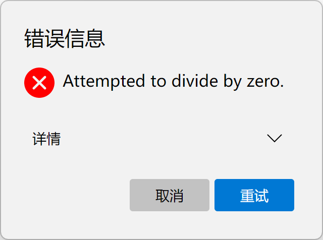 | 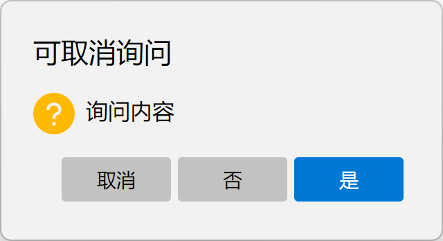 |

### 输入对话框

`InputDialog`类提供输入对话框的宿主UI。通过`InputDialogContent`配置内容。

可以设置以下属性：

| 属性                   | 描述                                                         |
| ---------------------- | ------------------------------------------------------------ |
| `Message`              | 显示在标题下方的具体信息                                     |
| `Text`                 | 显示在输入框中的文本                                         |
| `Watermark`            | 显示在输入框中的占位符水印                                   |
| `MultiLines`           | 是否允许多行输入                                             |
| `PasswordChar`         | 密码隐藏字符。若为`\0`，则表示非密码输入                     |
| `MinLines`, `MaxLines` | 最少和最多行数                                               |
| `Validations`          | 一个`Func<string, ValidationResult>`列表，用来指定用户输入内容的验证函数。任意验证函数内抛出异常，则认为用户输入不符合要求，界面中弹出报错信息。 |

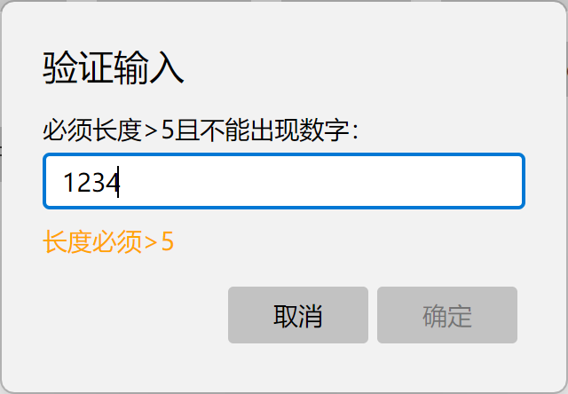

### 选择对话框

`SelectItemDialog`类提供单选对话框的宿主UI，通过`SelectDialogContent`配置内容；`CheckItemDialog`类提供多选对话框的宿主UI，通过`CheckDialogContent`配置内容。

通过配置`Items`来指定选项。

| 属性           | 描述                                         | 备注                 |
| -------------- | -------------------------------------------- | -------------------- |
| `Title`        | 选项的标题                                   |                      |
| `Detail`       | 选项的补充信息                               |                      |
| `Tag`          | 每个选项可以附带任意类型的对象，用以后续区分 |                      |
| `SelectAction` | 单击该选项后，立即做出的动作                 | 仅`SelectDialogItem` |
| `IsChecked`    | 选项是否被选择                               | 仅`CheckDialogItem`  |
| `IsEnabled`    | 选项是否可被选择                             | 仅`CheckDialogItem`  |


| 单选对话框                                                   | 多选对话框                                                   |
| ------------------------------------------------------------ | ------------------------------------------------------------ |
| 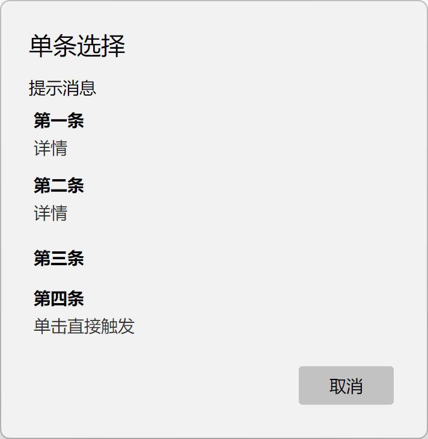 | 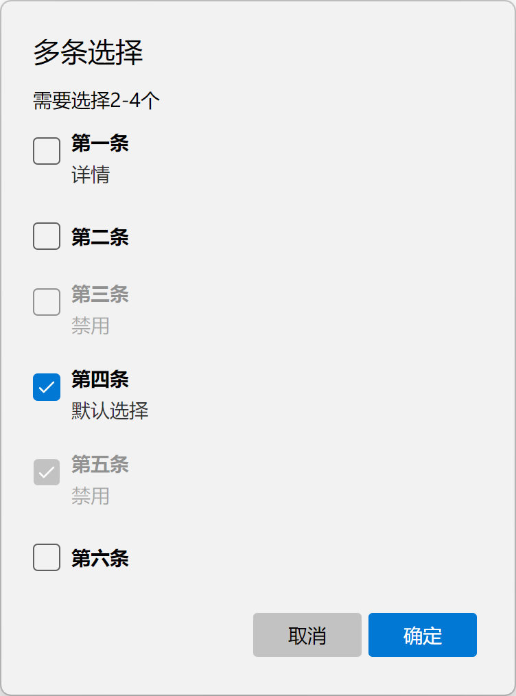 |


## `Dialogs.Services`目录

为对话框提供适应MVVM的服务

